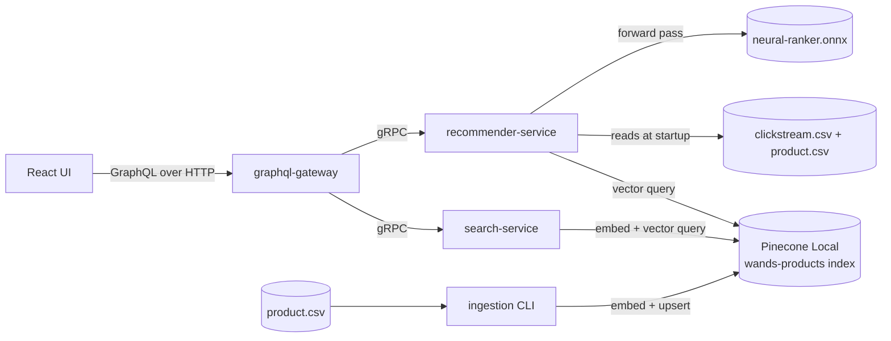

# Recommendation Engine

A React + GraphQL recommendation engine over the [WANDS](https://github.com/wayfair/WANDS)
(Wayfair) furniture catalog. Sibling portfolio project to
[`search`](https://github.com/avantiwhenever/search) (hybrid lexical/semantic
search over the same catalog) — this one explores a different backend stack
(Pinecone instead of self-hosted Elasticsearch) and a different problem
(personalized re-ranking/recommendation strategies instead of retrieval
quality), built with hexagonal architecture and gRPC-only inter-service
communication throughout.

> **[Live snapshot demo →](https://techbyavanti.github.io/recommendation-engine/)** —
> real captured results comparing all 6 strategies side by side (static
> GitHub Pages page, not a live backend — [run it yourself](HOWTO.md) for
> the real thing).

## Reading this README

This page serves a few different readers. Pick the path that fits — each is
short and self-contained, no need to read the others first.

<details>
<summary><strong>I'm a recruiter / skimming this — what is it? (30 seconds)</strong></summary>

A full-stack, working recommendation engine: a React search UI, a GraphQL
API layer, three backend microservices written in Java, a real vector
database, and a machine-learning model trained from scratch — all built by
one person, all actually runnable on a laptop with one command
(`docker compose up`), no cloud account needed.

It searches a real furniture catalog (43,000 products) and can switch
between six different recommendation strategies live — including one backed
by a neural network trained on the project's own clickstream data. It's
paired with a sibling search project ([`search`](https://github.com/avantiwhenever/search))
that takes a different, more classic approach to the same catalog, for
comparison. [See the live snapshot demo →](https://avantiwhenever.github.io/recommendation-engine/)

</details>

<details>
<summary><strong>I'm curious about the recommendation strategies specifically</strong></summary>

Six strategies, each documented with how it works, how it differs from the
others, and its real offline-evaluation numbers — see the
[live demo's "Six strategies, and how they differ" section](https://avantiwhenever.github.io/recommendation-engine/#five-strategies-and-how-they-differ)
or [RESULTS.md](RESULTS.md) for the raw numbers and methodology.

</details>

<details>
<summary><strong>I'm a technical hiring manager — what does this actually demonstrate? (2 minutes)</strong></summary>

Concrete, verifiable engineering signal, not a tutorial-follow-along project:

- **System design under real constraints**: hexagonal architecture
  enforced across three Java services, gRPC as the only inter-service
  protocol, GraphQL confined to a single frontend-facing gateway — a
  deliberate architectural discipline, not whatever a framework defaulted
  to. See [docs/ARCHITECTURE.md](docs/ARCHITECTURE.md).
- **ML work with real rigor, not a black box**: a pairwise learning-to-rank
  model (XGBoost) trained on the project's own implicit clickstream
  feedback, with a golden-vector test enforcing feature parity between the
  Java serving path and the Python training pipeline. See `training/TRAINING.md`.
- **A real offline evaluation harness**: every strategy is scored against
  two independent ground truths (an implicit clickstream-derived signal and
  WANDS' original human relevance judgments) plus an off-policy (IPS)
  reward estimate — not a single flattering metric. See [RESULTS.md](RESULTS.md).
- **Production-adjacent engineering hygiene**: CI with dependency/image
  vulnerability scanning, SAST, secret scanning, and Dependabot; tests at
  every layer (pure unit, in-process gRPC integration, real end-to-end
  against live infrastructure); Dockerized everything with a documented
  local-first, cloud-optional path.
- **Grounded in the literature, not vibes**: every recommendation strategy
  cites the specific arxiv paper(s) or industry engineering writeup it's
  based on — see "arxiv grounding" below.

</details>

<details>
<summary><strong>I'm reviewing this codebase — where do I start?</strong></summary>

Go straight to [docs/ARCHITECTURE.md](docs/ARCHITECTURE.md) — it's a
reviewer-oriented tour with a suggested reading order, a map of where the
hexagonal layers live on disk, and what's tested at which layer. Come back
to this README for the "why" behind specific decisions (table below) and
[HOWTO.md](HOWTO.md) to actually run it.

</details>

## Why this project

Most "recommendation engine" portfolio projects are a single service with a
hardcoded ranking formula. This one is built to demonstrate three things
most such projects skip:

1. **A real architectural discipline** — hexagonal (ports & adapters)
   throughout, with gRPC as the only inter-service protocol and GraphQL
   confined to the single frontend-facing edge, so the domain/business logic
   in every service is testable without Spring, without a network, and
   without Docker.
2. **Recommendation strategies grounded in actual literature**, not
   invented — see "arxiv grounding" below — including a from-scratch-trained
   ONNX neural ranking model, not just heuristics.
3. **A fully local, account-free path to running the whole thing** —
   Pinecone Local (a real Docker-based emulator, not a mock) means
   `docker-compose up` gets you a working vector-search-backed system with
   no cloud account, no API key, and no cost, while staying a config change
   away from a real hosted Pinecone index.

**The honest tradeoff**: hexagonal-architecture-plus-gRPC-only-plus-four-
services is more service boundary than a single-node, 43K-product,
no-real-traffic system actually needs. This is here to demonstrate
hexagonal/gRPC/GraphQL-gateway competency on purpose, not because 43K
products need three JVMs and a protobuf contract between them. A system
this size, built to actually ship, would likely be one service with clean
internal module boundaries — the *pattern* (ports & adapters, a tested
domain core) is the same either way, but the network hops between services
aren't earning their keep at this scale. Read the rest of this README as
"here's how I'd structure the boundaries if this had to scale to many teams
and services," not as "this is the right size for this problem."

## Key decisions

| Decision | Choice | Why |
|---|---|---|
| Dataset | [WANDS](https://github.com/wayfair/WANDS) furniture catalog + a synthetic clickstream | Same real catalog/queries as the sibling `search` project; clickstream is fabricated (documented honestly, see [avantiwhenever/WANDS `CLICKSTREAM.md`](https://github.com/avantiwhenever/WANDS/blob/main/CLICKSTREAM.md)) since WANDS ships no behavioral data, and the recommendation strategies need implicit feedback to train on. |
| Architecture | Hexagonal (ports & adapters) in every Java service | `domain`/`application`/`port` packages have zero framework imports — testable without Spring, gRPC, or a network. A deliberate, explicit constraint on this project, not an emergent pattern. |
| Inter-service protocol | gRPC only between Java services | No REST anywhere except the single GraphQL/HTTP edge the frontend talks to. Shared `.proto` contracts in `proto/` are the real "ports" between services. |
| Frontend protocol | GraphQL, exactly one gateway | `graphql-gateway` is the only service with an inbound HTTP adapter; everything downstream is gRPC. |
| Vector store | Pinecone, via **Pinecone Local** for development | A real Docker-based Pinecone emulator (`ghcr.io/pinecone-io/pinecone-local`) — no account/API key needed to run the full stack locally; pointing at a real hosted Pinecone free-tier index later is a config change (`PINECONE_HOST`/`PINECONE_API_KEY`), not a code change. Not persistent and capped at 100K vectors — a documented dev/demo tradeoff, not a production claim. |
| Retrieval | Hybrid dense (Pinecone) + lexical (embedded BM25), fused via RRF | Dense-only embedding search is known-worse on exact-match queries (SKUs, model numbers, brand names); an embedded, in-memory BM25 index avoids adding a self-hosted search server just for this. |
| Embeddings | `bge-small-en-v1.5` via ONNX Runtime, client-side | Pinecone Local has no server-side integrated inference, so embeddings are generated in-process — the one piece ported directly from the sibling `search` project, since it's self-contained (no Spring, no Elasticsearch). |
| Recommendation strategies | Popularity, collaborative filtering, bandit exploration, an MMR diversity decorator, and an ONNX neural ranker | Each traceable to a specific paper or real engineering blog post — see "arxiv grounding" and "Additional grounding" below — rather than an arbitrary re-ranking heuristic. |
| Build tool | Maven, multi-module reactor | Same rationale as the sibling `search` project: declarative dependency graphs are easy for a reviewer to skim. |
| Java version | JDK 26 | Matches the sibling `search` project's choice — latest available toolchain. |

## arxiv grounding

Recommendation strategies are each tied to real recommender-systems
literature, not invented ad hoc:

- [A Survey of Real-World Recommender Systems: Challenges, Constraints, and Industrial Perspectives](https://arxiv.org/abs/2509.06002) (arXiv:2509.06002) — candidate-generation-then-rerank architecture grounding
- [Applying Deep Learning to Airbnb Search](https://arxiv.org/pdf/1810.09591) (arXiv:1810.09591) — LambdaRank-style pairwise training objective for the neural ranking model
- [A Survey on Generative Recommendation: Data, Model, and Tasks](https://arxiv.org/abs/2510.27157) (arXiv:2510.27157)
- [Large Language Model Enhanced Recommender Systems: A Survey](https://arxiv.org/abs/2412.13432) (arXiv:2412.13432)
- [A Survey on LLM-powered Agents for Recommender Systems](https://arxiv.org/abs/2502.10050) (arXiv:2502.10050)

## Additional grounding (not on arxiv)

- Sarwar, Karypis, Konstan & Riedl, ["Item-Based Collaborative Filtering Recommendation Algorithms"](https://dl.acm.org/doi/10.1145/371920.372071) (WWW 2001) — the adjusted-cosine normalization the collaborative filtering strategy uses
- Etsy — ["Building a Platform for Serving Recommendations at Etsy"](https://www.etsy.com/codeascraft/building-a-platform-for-serving-recommendations-at-etsy) (OPAR: bandit arms as product attributes, not raw items or positions)
- Spotify Research — ["Calibrated Recommendations with Contextual Bandits on Spotify Homepage"](https://research.atspotify.com/2025/9/calibrated-recommendations-with-contextual-bandits-on-spotify-homepage) (context-conditioned arm selection + a calibration constraint)
- Netflix — ["Recommendations: Beyond the 5 stars"](http://techblog.netflix.com/2012/04/netflix-recommendations-beyond-5-stars.html) Part 1 / Part 2 — MMR-style diversity re-ranking, and blending popularity for new users
- Pinterest — ["Real-time User Signal Serving for Feature Engineering"](https://medium.com/pinterest-engineering/real-time-user-signal-serving-for-feature-engineering-ead9a01e5b) and Etsy's ["Leveraging Real-Time User Actions to Personalize Etsy Ads (ADPM)"](https://www.etsy.com/codeascraft/leveraging-real-time-user-actions-to-personalize-etsy-ads) — session-recency weighting
- Pinterest (KDD 2022) — [ItemSage: Learning Product Embeddings for Shopping Recommendations at Pinterest](https://arxiv.org/abs/2205.11728) — one shared embedding space reused across retrieval surfaces, the pattern behind `recommender-service`'s `VectorSimilarityPort`
- LinkedIn — ["Making Your Feed More Relevant – Part I"](https://engineering.linkedin.com/blog/2015/11/making-your-feed-more-relevant--part-i) and DoorDash — ["Powering Search & Recommendations at DoorDash"](https://careersatdoordash.com/blog/powering-search-recommendations-at-doordash/) — the widen-then-select multi-stage retrieval pipeline
- Criteo — ["Offline A/B Testing for Recommender Systems"](https://arxiv.org/pdf/1801.07030) and Spotify Research's [counterfactual-evaluation work](https://research.atspotify.com/publications/towards-a-fair-marketplace-counterfactual-evaluation-of-the-trade-off-between-relevance-fairness-satisfaction-in-recommendation-systems) — the off-policy (IPS) evaluation methodology

## Architecture

```
recommendation-engine/
├── rec-support/             shared infrastructure only (WANDS CSV parsing, ONNX embedding
│                            pipeline, Pinecone client wrapper) — no domain logic, no business logic
├── search-service/          hexagonal, gRPC-served — hybrid dense/lexical search over WANDS products
├── recommender-service/     hexagonal, gRPC-served — pluggable recommendation strategies
├── graphql-gateway/         hexagonal — the only GraphQL/HTTP inbound adapter in the system;
│                            a gRPC client to both services above
├── web/                     React (Vite + TypeScript) + Apollo Client
├── proto/                   shared .proto contracts — the real inter-service ports
├── training/                Python: trains the ONNX neural ranking model from the clickstream data
├── data/                    WANDS catalog + clickstream (gitignored, fetched via scripts/download-data.sh)
└── docker-compose.yml       pinecone-local + all four services, no external account needed
```



GraphQL exists only on the `ui → gw` edge. Every other edge between Java
services is gRPC (talking to Pinecone directly is a shared infrastructure
dependency, not inter-service traffic). Each Java service follows the same
internal hexagonal package layout:

```
<service>/src/main/java/.../<service>/
├── domain/       entities + value objects — zero framework imports
├── application/  use-case implementations — zero framework imports
├── port/
│   ├── in/       inbound port interfaces (use cases)
│   └── out/      outbound port interfaces (VectorIndexPort, ClickstreamRepositoryPort, ...)
├── adapter/
│   ├── in/       gRPC server adapter (graphql-gateway instead has adapter/in/graphql/)
│   └── out/      Pinecone adapter, ONNX adapter, gRPC client adapters, ...
└── config/       Spring wiring only — binds ports to adapter beans
```

Recommendation strategies (`recommender-service`), each a
`RecommendationStrategy` implementation selected by a GraphQL-level enum:

1. **None** — baseline, no changes (control group), still subject to the
   gateway's hard eligibility selection stage applied to every strategy.
2. **Popularity** — reranks by a blend of search relevance and
   clickstream-derived popularity; can inject globally popular products
   absent from the original candidates.
3. **Collaborative filtering** — item-item CF: adjusted-cosine-normalized
   similarity over session co-occurrence (Sarwar, Karypis, Konstan &
   Riedl, WWW 2001), weighted more heavily for the current browsing
   session than all-time history, with a named popularity fallback for
   users with no history at all.
4. **Bandit exploration** — Thompson Sampling over per-category arms,
   warm-started from real historical engagement and conditioned on the
   requesting user's category profile (Etsy's OPAR pattern, Spotify's
   calibrated-bandit pattern).
5. **Neural ranking** — a gradient-boosted pairwise ranking model
   (XGBoost, `rank:ndcg`), served via ONNX Runtime, over 7 features
   including same-session category overlap.
6. **Diverse popularity** — Popularity, then an MMR (maximal marginal
   relevance) re-rank pass on top, trading some ranking quality for
   category spread; a decorator that can wrap any strategy's output. Its
   diversity metric blends real Pinecone embedding similarity (via
   `VectorSimilarityPort`, reusing `search-service`'s embedding index) with
   a cheap category/product-class proxy, rather than the category proxy
   alone — see `DiversityAwareStrategy`'s class Javadoc for why blended,
   not substituted, and why one embedding lookup per candidate, not one per
   pairwise comparison.

See [docs/PROJECT_STATE.md](docs/PROJECT_STATE.md)'s "Known simplifications"
section for open gaps, including where `VectorSimilarityPort` still isn't
used (`NeuralRankingStrategy`'s zero-footprint-item fallback).

## Offline evaluation

Every strategy is scored against **two independent ground truths** — an
implicit clickstream-derived signal, and WANDS' original human relevance
judgments, which no strategy is trained or tuned against — plus an
off-policy (IPS) reward estimate using the synthetic clickstream's known,
documented logging policy. See [RESULTS.md](RESULTS.md) for the full
methodology and numbers; regenerate with `./scripts/run-recommender-eval.sh`.

## Data notes

WANDS' own quirks (tab-delimited `.csv` files, `category hierarchy` column
name with a space) are inherited via the ported `WandsProductCsvLoader` —
see the sibling `search` project's README for the full discovery story.
The clickstream dataset is entirely synthetic — see
[avantiwhenever/WANDS `CLICKSTREAM.md`](https://github.com/avantiwhenever/WANDS/blob/main/CLICKSTREAM.md)
for the generation methodology (position-biased cascade click model,
relevance-conditioned on WANDS' real relevance judgments) and an explicit
disclaimer that it does not represent real user behavior.

## Local setup

See **[HOWTO.md](HOWTO.md)** for step-by-step instructions to run the full
stack locally via Docker Compose, including how to verify each step
actually worked.

## Reviewing this code

See **[docs/ARCHITECTURE.md](docs/ARCHITECTURE.md)** for a reviewer-oriented
tour of the codebase: where to start reading, how the hexagonal layers map
to actual files, and what's tested where. See
**[docs/PROJECT_STATE.md](docs/PROJECT_STATE.md)** for operational facts
worth knowing (dependency quirks, build order, known limitations) without
re-deriving them from scratch.
